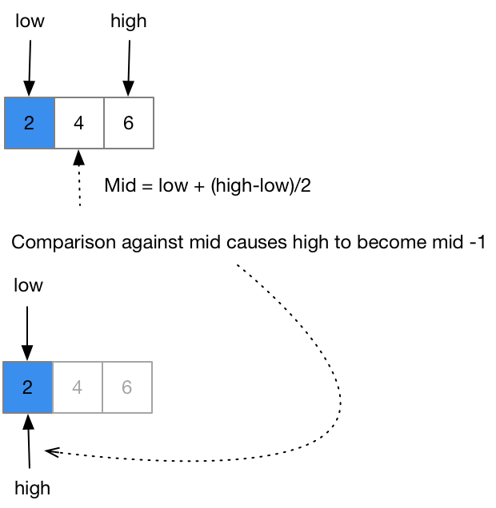

# BinarySearch
The code is as follows

```csharp
        public int BinarySearch<T>(IList<T> arr, T val) 
          where T : IComparable<T>
        {
            if (arr == null)
                throw new ArgumentNullException();

            int loIdx = 0;
            int hiIdx = arr.Count - 1;
            while (loIdx <= hiIdx)
            {
                int miIdx = loIdx + (hiIdx - loIdx) / 2;
                int comp = val.CompareTo(arr[miIdx]);

                if (comp == 0)
                    return miIdx;

                if (comp > 0)
                    loIdx = miIdx + 1;
                else
                    hiIdx = miIdx - 1;
            }

            return ~loIdx;
        }
```

## Hit
Consider the successful search for the value 2 in the array {2,4,6}



## Miss
Consider the successful search for the value 3 in the array {2,4,6}


#software/algorithms